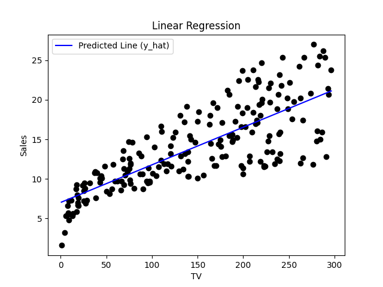

# Machine Learning Sample

## Overview

This repository contains a sample machine learning project that demonstrates the inner workings of machine learning
using a GPU without relying on machine learning frameworks. The intention is to provide an under-the-hood look at how
the mathematics, statistics, and algorithms work using a purposefully contrived example.

The project includes the following key components:

1. **SPNN (pronounced "spin") Model:** The `SpnnModel` class in `src/models/spnn_model.py` implements a single
   perceptron neural network model. It includes methods for setting up linear regression training
   (`setup_linear_regression_training()`), training the model (`train_linear_regression()`), and making predictions
   (`predict()`).
2. **Dataset Manager:** The `DataSetManager` class in `src/data/dataset_manager.py` handles the acquisition and
   management of datasets. It uses the `kagglehub` library to download datasets from Kaggle and stores them in a
   dictionary for easy access.
3. **Dataset Metadata:** The `DatasetMetadata` class in `src/data/dataset_metadata.py` handles metadata for a given
   dataset. It simplifies the process of computing column-wise mean, standard deviation, and normalisation. It also
   handles transposing features and labels within the dataset to facilitate matrix operations.
4. **Tests:** The `tests` directory contains unit tests for the `SpnnModel`, `DataSetManager`, and `DatasetMetadata`
   classes. The aim of the tests is to demonstrate that even seemingly unwieldy code can be tested effectively.

For the dataset, the project uses the TV Marketing dataset from Kaggle. The dataset contains the amount spent on TV
marketing and the resulting sales. The result of training the SPNN model on this dataset is a linear regression model
that looks like the following:



*Training Result*

## Intended Audience

The project is written for developers who are interested in exploring machine learning. There is an assumption that the
reader is proficient in Python and understands mathematics, statistics, and algorithms. The project relies on the
following concepts:
- Linear algebra
- Differential calculus (including partial derivatives)
- Matrices and vectors
- Means, standard deviations, and variances
- Linear regression and gradient descent

## Contributing

Contributions are welcome as are corrections. The author follows Crocker's Rules. Direct, honest, and constructive
feedback is appreciated. Please submit a pull request with your changes or an issue with your feedback.

## License

The project is licensed under the MIT License. Please see the `LICENSE` file for more information.

## Further Development

The project is a work in progress. More complex models will be added over time to provide a comprehensive overview of
machine learning.

## Getting Started

### Note to Windows Users

The code will not run on Windows due to package incompatibilities. If developing from Windows, please be sure to install
WSL and configure your IDEs accordingly.

### Hardware

The code is designed to run on an NVIDIA GPU.

### Operating System

The code is designed to run on Linux. The code is written with PyCharm on Windows, but is run using WSL 2.0 within
Windows using a clean Linux Ubuntu 24.04 LTS distribution.

> Remember to ensure that the NVIDIA CUDA Toolkit and drivers are installed on Windows for use by WSL. The NVIDIA 
> CUDA Toolkit will also need to be installed on the Linux distribution. As always, ensure that all operating systems
> are up-to-date before you begin.

### Software

To simplify the process, the following steps are recommended in exact order:
1. Install the NVIDIA CUDA Toolkit, version 12.4. You may run into an error, see the guidance within
   [this article](https://askubuntu.com/questions/1491254/installing-cuda-on-ubuntu-23-10-libt5info-not-installable) 
   to resolve the issue.
2. Install cuDNN for CUDA 12.
3. Install cuTENSOR for CUDA 12.
4. Install cuSPARSELt for CUDA 12.
5. Ensure that Python 3.12, pip, and the `venv` module are installed.
6. Install `venv` and create the `machine_learning_sample` virtual environment.
7. Install `pytorch` for CUDA 12.4, `tensorflow`, `cupy-cuda12x`, `scipy`, `optuna`, `sympy`, `matplotlib`, `pandas`,
   `kagglehub`, `coverage`, `pytest`, and `pytest-mock`.

In Ubuntu 24.04, Python 3.12 is installed by default. The following commands are used to install the remaining 
Python components:

```shell
sudo apt install python3-pip
sudo apt install python3-venv
````

To create and activate the virtual environment, the following commands are used:

```shell
python3 -m venv ~/.local/share/virtualenvs/machine_learning_sample
source ~/.local/share/virtualenvs/machine_learning_sample/bin/activate
````

> You'll need to configure your IDE to use the virtual environment.

To deactivate the virtual environment, the following command is used:

```shell
deactivate
````

The commands used for PyTorch and TensorFlow as well as the remaining packages are as follows:

```shell
pip3 install torch torchvision torchaudio --index-url https://download.pytorch.org/whl/cu124
pip3 install tensorflow
pip3 install cupy-cuda12x scipy optuna sympy matplotlib pandas kagglehub coverage pytest pytest-mock
```

### Testing

Tests are provided to make changing the code easier, which facilitates learning activities.

## Notes on the Code

While I don't like tightly coupling code, it is necessary in this context. For example, the dataset manager is tightly
coupled to KaggleHub and Pandas. At the time of writing, Python doesn't support interfaces. While I could use duck
typing or an abstract base class, doing so would overcomplicate the code by burying the tight coupling under layers of
indirection. This would make the code harder to understand and maintain without the benefit of solving the issue.

## Sample Datasets

The following datasets are used in the code:
1. [TV Marketing](https://www.kaggle.com/datasets/devzohaib/tvmarketingcsv/data) - A dataset containing the amount
   spent on TV marketing and the resulting sales. The dataset is used to demonstrate linear regression.

## Acknowledgements

The author would like to acknowledge the following individuals and organisations:
1. Luis Serrano in association with DeepLearning.AI for the inspiration to create this project. Their courses on
   Coursera delving into the mathematics of machine learning and data science prompted me to create this project. The
   code is based on the *Regression with Perceptron* lab from week 3 of the 
   [Calculus for Machine Learning and Data Science](https://www.coursera.org/learn/machine-learning-calculus?specialization=mathematics-for-machine-learning-and-data-science)
   course within the
   [Mathematics for Machine Learning and Data Science Specialization](https://www.coursera.org/specializations/mathematics-for-machine-learning-and-data-science).
2. The user "[devzohaib](https://www.kaggle.com/devzohaib)" on Kaggle for providing the TV Marketing dataset.

## References

- [NVIDIA CUDA Toolkit 12.4 Installation](https://developer.nvidia.com/cuda-12-4-0-download-archive)
- [cuDNN for CUDA 12 Installation](https://developer.nvidia.com/cudnn-downloads)
- [cuTENSOR for CUDA 12 Installation](https://developer.nvidia.com/cutensor-downloads)
- [cuSPARSELt for CUDA 12 Installation](https://developer.nvidia.com/cusparselt-downloads)
- [Python Virtual Environments](https://docs.python.org/3/library/venv.html)
- [PyTorch Installation](https://pytorch.org/get-started/locally/)
- [TensorFlow Installation](https://www.tensorflow.org/install)
- [Hugging Face Transformers Installation](https://huggingface.co/docs/transformers/installation)
